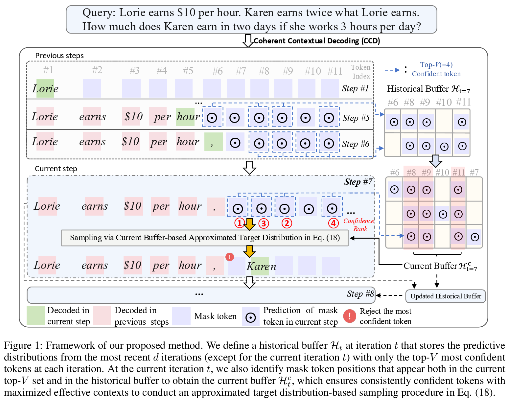

<h1 style="display: flex; justify-content: center; align-items: center; gap: 10px; margin: 0;">
  Beyond Confidence: Adaptive and Coherent Decoding for Diffusion Language Models
</h1>

<em>A novel decoding method for DLMs from a new perspective.</em>

  

[ 

This is a preliminary PyTorch implementation of our paper:

[Beyond Confidence: Adaptive and Coherent Decoding for Diffusion Language Models](https://arxiv.org/abs/2512.02044). 

If you have any problems, please email me (ck.ee@my.cityu.edu.hk).

# Usage

1. Run [inference_optimization_release.py](https://github.com/tonyckc/CCD-DLM-code/blob/main/inference_optimization_release.py)  and choose different decoding types, i.e., "ours" (CCD) or "dream" （entropy）)

2. We provide the  [Trip](https://github.com/google-deepmind/natural-plan) benchmark for your quick validation.

3. We will continue to provide full codes as much as possible.
